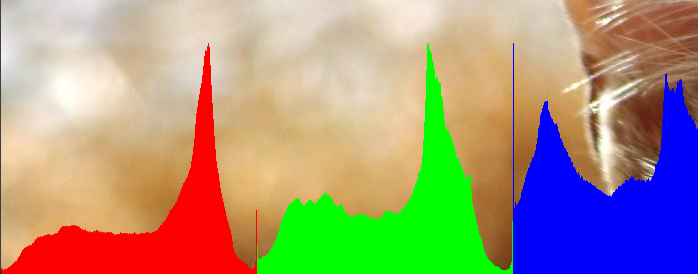

# Week 2 Tasks

Explored manipulating colours in an image by targeting pixels

Created histograms for images uploaded

Created greyscale images and altered brightness of pixels

##Requirements:

- Written in Processing 4.3
- Run all files in Processing
- Ensure files in data folder are downloaded for sketch to work

## 2 Colour Team File

- worked with Mikaela - I was coding while she was advising 
- followed code done in class for colour swapping
- changed colour of image from oranges and yellows to blues and greens
- unexpected outcome: pixels did not stay blue but instead were flashing between the original and modified colours
- not sure why, but gave a cool outcome!
- (see '2-colour-flower.gif' file for outcome)


## Greyscale Weekly Task File

- weekly task: use the code given to revert the image back to original colour + 3 histograms for red, green, blue levels (RGB)
- removed 'loadPixels' and displayed original image with: 'image(sample, 0, 0);
- changed 'histogram' to 'redHistogram' (was measuring red channel already)
- added 
```
int[] greenHistogram = new int[256];
int[] blueHistogram = new int[256];
```
- added
```
int rPixelShade = int(red(sample.pixels[i]));
int gPixelShade = int(green(sample.pixels[i]));
int bPixelShade = int(blue(sample.pixels[i]));
``` 
to calculate histograms
- changed ```histogram[pixelShade]++;``` to ```redHistogram[rPixelShade]++;``` and added the same for green and blue channels 
- changed ```float startHeight = map(histogram[i], 0, max(histogram), height, height-(height/3));```

```line(i, startHeight, i, height);``` to correct variable names and did the same for blue and green histograms:

```// red histogram
stroke(255, 0, 0);
float rStartHeight = map(redHistogram[i], 0, max(redHistogram), height, height-(height/3));
line(i, rStartHeight, i, height);

// green histogram
stroke(0, 255, 0);
float gStartHeight = map(greenHistogram[i], 0, max(greenHistogram), height, height-(height/3));
line(i, gStartHeight, i , height);

//blue histogram
stroke(0, 0, 255);
float bStartHeight = map(blueHistogram[i], 0, max(blueHistogram), height, height-(height/3));
line(i, bStartHeight, i, height);
```

- also added '[i + 256]' for the green histogram and '[i + 512]' for blue histogram to shift them to right so they are visible
- (could not add screengrab of outcome as the window is too large for the screen( image size is too large))

Histogram values: (had to change window size to 700, 700 to fit on screen)

    

