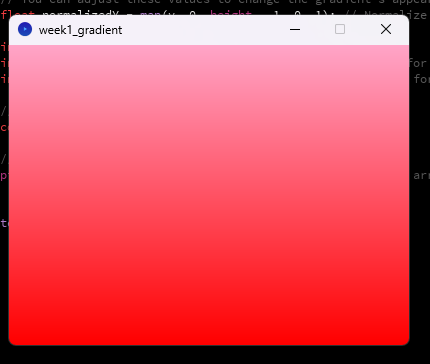

# Week 1 Tasks

Experimented and explored pixels on the screen
Worked with finding pixels and getting the colour
Experimented with gradients and different directions and colours of the gradient

**Requirements:**
Written in Processing 4.3
Run 'pixels' and 'gradient' file in Processing


**GRADIENT WEKLY TASK FILE**

- followed code in class
- changed colours to pink red and white 
changed code to:
```int red = int(255); // red stays at max
int green = int(165 * (1 - normalizedY)); // green varies for red to orange
int blue = int(200 * (1 - normalizedY));
```
- changed gradient from horizontal to vertical:
```float normalizedY = map(y, 0, height - 1, 0, 1);```
    

    
