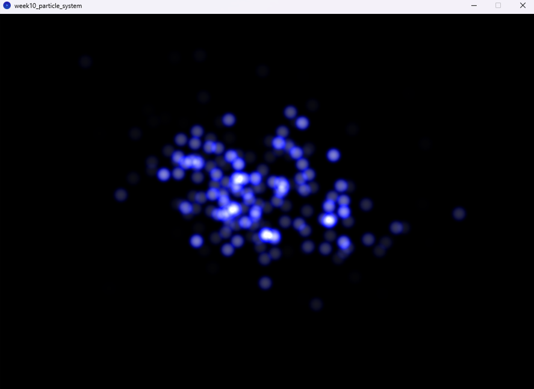
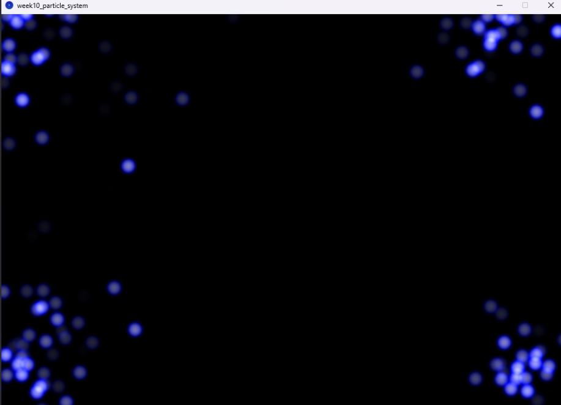

# Week 10 Tasks
- Recapped vectors
- Explored particle systems and how it can be used
- Implemented particle systems and array lists 


**Requirements:**

- Written in Processing 4.4.4
- Run files in Processing
- Ensure all class files are accessable for sketch to work


**Particle System Weekly Task**

Aim : Create an interactive sketch implementing particle systems and array lists. It should include:

- At least 3 vectors for each particle (location, v, a)
- At least 2 type of user interaction implementing the system
- At least 1 force e.g. wind


- Started by going over code example: 'particle_system'
- Wanted to make a firework type visual effect

- Created a particle class file first
- stated variables like lifespan, all the forces, position and colour
- created a ```void spawn()``` function to activate the particles
- made the colour random(255) so that a different colour is generated every time you click
- used the same ```void display()``` as the code given in class
- removed the stroke and changed fill to tint


- Moved on to creating a 'ParticlSystem' class
- created an array list for the particles:
```ArrayList<Particle> particles = new ArrayList<Particle>();```
- created particles using a for loop then added to the array list:

```particleSpawner(int number) {
     if(number < 1) {
         number = 1;
     }
     for (int i=0; i< number; ++i) {
       particleList.add(new Particle());
     }
   }
```


- Set the window size to (1000, 700)
- Downloaded free particle png from the internet to use (shown in data file)
- created an explosion function to make particles explode outwards (the trig took a lot of tweaking...)
- took a while to fix all syntax, capitlisation and object usage errors

- image size was too big to see anything happening so I scaled it down
- changed render function from: 
```void render() {
    if (!active) return;
    tint(c);
    image(particleImage, pos.x - particleImage.width / 2, pos.y - particleImage.height / 2);
  }
}
```

to: 

```void render() {
    if (!active) return;
    tint(c);
    float scale = 0.5;  // scale to 50% of original size
    float w = particleImage.width * scale;
    float h = particleImage.height * scale;
    image(particleImage, pos.x - w/2, pos.y - h/2, w, h);
  }
```

- now I needed to add mouse interactions 
- added: ```void mousePressed() {
    particleList.add(new Particle(mouseX, mouseY, 60));
  }
``` 
  but this did not work - constructor error

- addded this to Particle class: 
```Particle(float x, float y, int lifespan) {
    this.pos = new PVector(x, y);
    this.lifespan = lifespan;
  }
```
- mouse interactions still not working - added PVector origin;
- changed scale from 0.5 to 0.1 to help lag 
- changed tint() in render function to: ```tint(c, map(lifespan, 0, 255, 0, 255));``` for fading out effect

Outcome so far:




