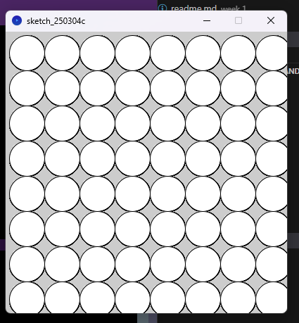
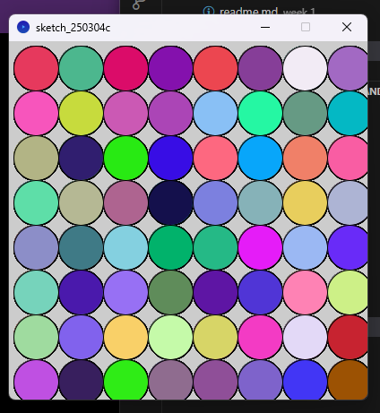
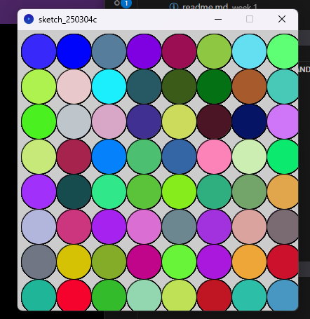
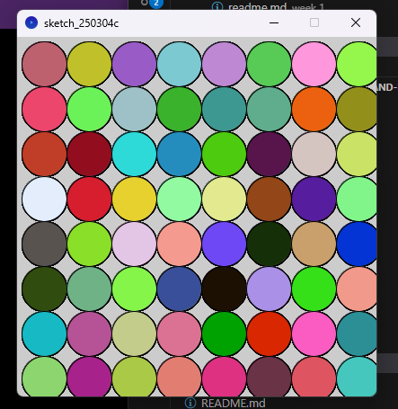
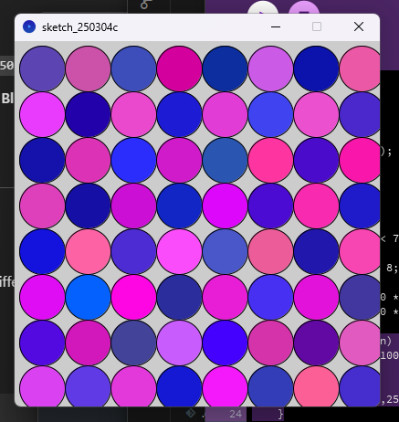
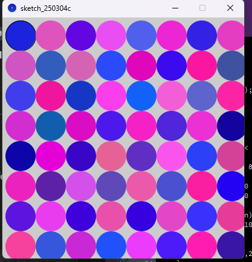

# Week 2 Tasks

- Explored vector graphics
- Used vector primities to construct different shapes
- Explored vector transformations and states (transformation matrix)

**Requirements:**

- Written in Processing 4.3
- Run all files in Processing


**Weekly Task - 'circle grid' file**

The weekly task was to make a grid of circles, with each circle having a different colour in a checkerboard pattern.

- started by making 400x400 window
- then in the draw function, I made my grid:

```for (int i = 0; i < 70; i++) 
int row = i / 8;
int column = i % 8;

float x = 30 + 50 * column;
float y = 30 + 50 * row;'
```

- had to alter 'i < 70' value a few times to ensure the window was full
-
- then tried to select random colours:
```
fill(random(255), random(255), random(255));
```
- but this returned the colours of the circles alternating between random RGB values every second:

  

- had to add 'noLoop();' in the setup
- decided to add an 'if' statement to get the checkerboard pattern
- added:
```
if ((row + column) % 2 == 0) {
  fill(random(0,100), random(0, 100), random(150, 255));
}
else {
  fill(random(200,255), random(0, 100), random(150,255));
}
```
- this makes the checkboard pattern where every other circle is either a shade of blue or pink
- shades of blue in the '((row + column) % 2 == 0)' line
- shades of pink in the 'else' statement
 
- decide to do 'noStroke();' for a better look
  