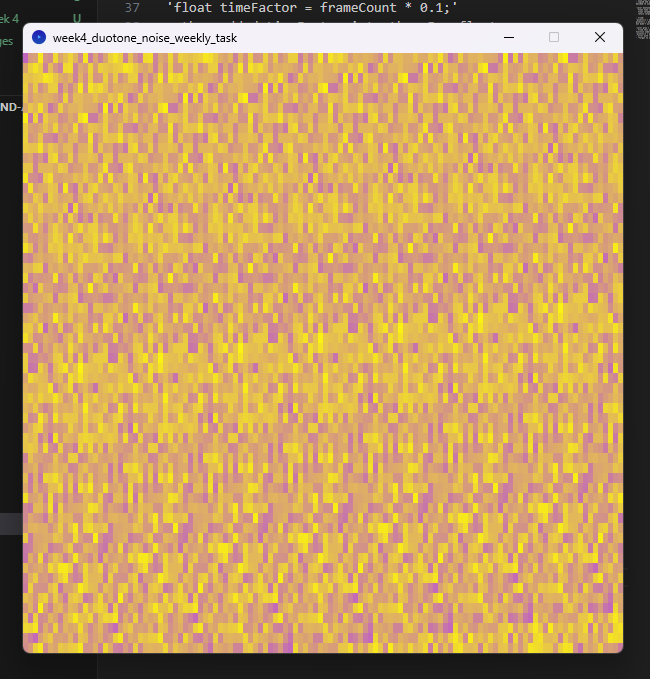
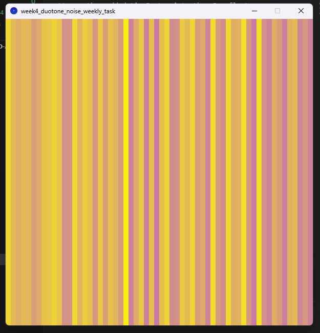
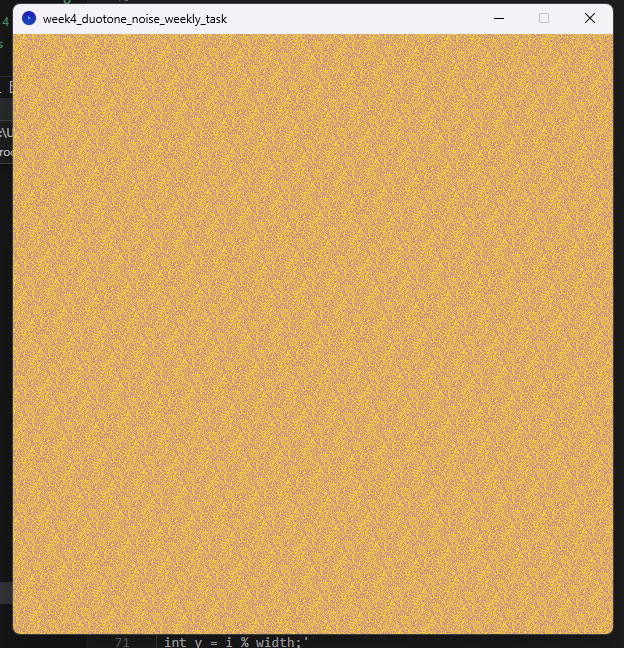
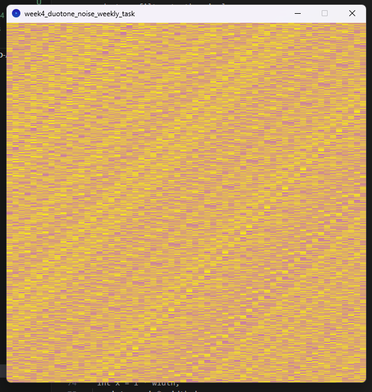
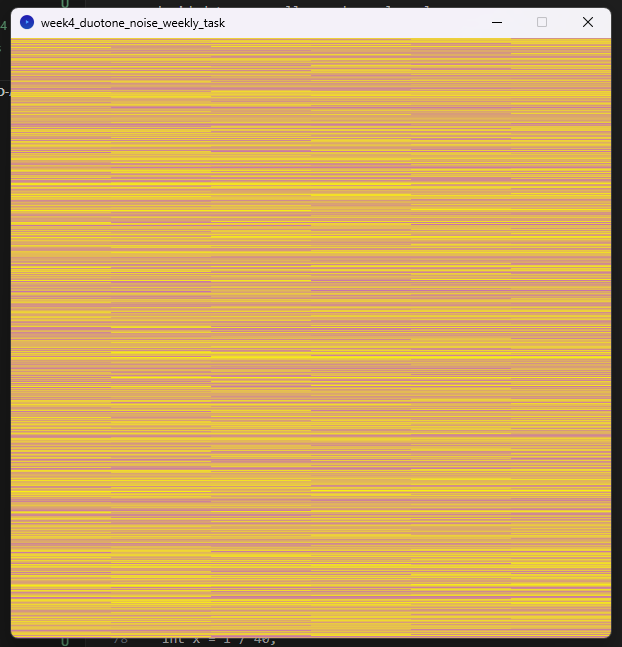

# Week 4 Tasks

- Understanding of true randomness and structured unpredictability
- Explored and implemented perlin noise to generate patterns
- Analysed applicationa of perlin noise
- Applied filters to images - brightness, contrast etc
- Practiced functions that use parameters

**Requirements:**
Written in Processing 4.3
Run files in Processing


**Duotone Noise WEEKLY Task**

Aim: create a landscape using Perlin noise and then apply a duotone filter to the pixels

- used code written to create Perlin noise in class
- copied and pasted the 'duotone' function made in class - decided to use yellow and purple colours:
```
color duotone(color pixel, color colorA, color colorB) {
float tone = red(pixel);
float lerpAmount = norm(tone, 0, 255);
return lerpColor(colorA, colorB, lerpAmount);'
```
- tried: 
``` 
pixels[i] = map(noise(x/5, y/10), 0, 1, 0, 255);
pixels[i] = duotone(pixels[i], colorA, colorB);
```
but didn't work
```
color gray = color(map(noise(x/5, y/10), 0, 1, 0, 255));
```
- Tried this and it worked, so then I added the duotone function underneath to convert grayscale pixels:
```
pixels[i] = duotone(gray, colorA, colorB);
```
- error with the colorA and colorB functions?
- ^forgot to add 'color colorA =' 

Output:


Other interesting outputs:


```
int x = i % width;
int y = i % width;
```


```
int x = i * width;
int y = i * width;
```


```
int x = i / 40;
int y = i % width;
```


```
int x = i / 50;
int y = i / width;'
```