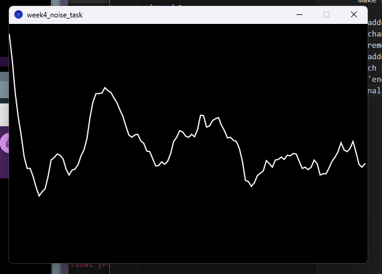
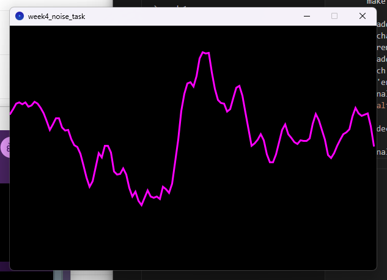

# Week 4 Tasks

- Understanding of true randomness and structured unpredictability
- Explored and implemented perlin noise to generate patterns
- Analysed applicationa of perlin noise
- Applied filters to images - brightness, contrast etc
- Practiced functions that use parameters

**Requirements:**
Written in Processing 4.3
Run 'pixels' and 'gradient' file in Processing

**Noise Vertex Task**

Aim: replace the rectangles with the vertex() functions to make a smooth line based on Perlin noise

- added 'beginShape()' function above the original for loop
- changed yPos into a float value
- removed 'rect(xPos + (xStep*i), yPos, xStep, xStep);'
- added: 'vertex(i*xStep, yPos);' to create a vertex at each x position
- 'endShape();'
Final output:

- decided to change colour to magenta: 'fill(255, 0, 255);'
'
Final output:

**2D Noise Vertex Task**

Next was to make our sketch move up and down by using the 2nd dimension

- added a 'timeFactor' for speed of movement:
'float timeFactor = frameCount * 0.1;'
- then added timeFactor into the yPos float
- produced somewhat jagged movement, but I liked the staticness of the output

**Duotone Noise WEEKLY Task**

Aim: create a landscape using Perlin noise and then apply a duotone filter to the pixels

- used code written to create Perlin noise in class
- copied and pasted the 'duotone' function made in class - decided to use yellow and purple colours:

'color duotone(color pixel, color colorA, color colorB) {
  float tone = red(pixel);
  float lerpAmount = norm(tone, 0, 255);
  return lerpColor(colorA, colorB, lerpAmount);'

- tried:  
'pixels[i] = map(noise(x/5, y/10), 0, 1, 0, 255);
pixels[i] = duotone(pixels[i], colorA, colorB);'  
but didn't work

'color gray = color(map(noise(x/5, y/10), 0, 1, 0, 255));'
- Tried this and it worked, so then I added the duotone function underneath to convert grayscale pixels:
'pixels[i] = duotone(gray, colorA, colorB);'
- error with the colorA and colorB functions?
- ^forgot to add 'color colorA =' 

Output:

Other interesting outputs:

'int x = i % width;
 int y = i % width;'

'int x = i * width;
    int y = i * width;'

'int x = i / 40;
    int y = i % width;'

'    int x = i / 50;
    int y = i / width;'

