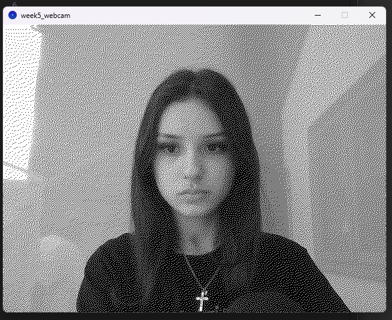
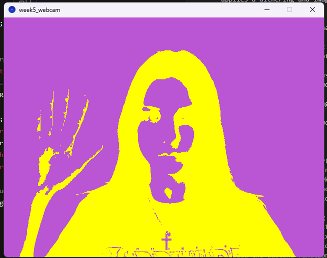
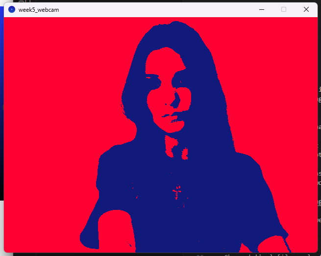
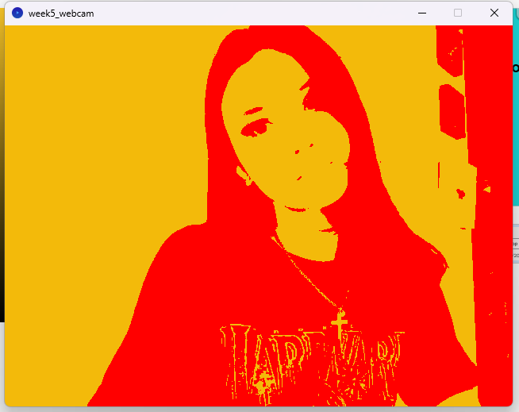
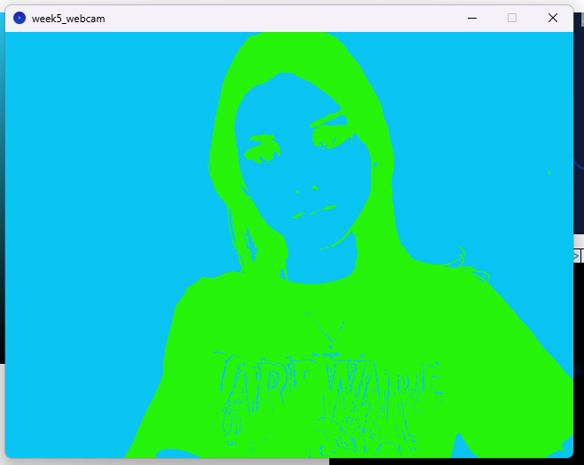

# Week 5 Tasks

- Explored dithering and how it creates colour depth and detail
- Created different dithering algorithms to vary effectiveness and aesthetics
- Explored convolution and applied convolution kernels to an image 


**Requirements:**
Written in Processing 4.3
Run files in Processing


**Webcam Weekly Task**

Aim: Implement a real-time image program that applies a dithering and image filter (duotone) to the webcam

- Followed class code to enable Processing access to webcam 
- Also added the screenshot function where if 's' key is pressed, a screenshot is taken and saved to disk 
- Copy pasted code from class for the dithering filter - dithering filter works on the webcam!



- Used code from previous week's lecture on image filters - duotone 
- Used yellow (255, 255, 0) and purple (186, 85, 211) colours A and B
- Changed Pixels[i] = color(newPixelValue); ' to 'pixels[i] = duotone(color(newPixelValue), colorA, colorB; ' so the pixels work with the duotone colours instead of just black and white
- also added colorA and colorB as extra values to fsDither
- cleaned up code by adding float ```newGrey = neighbourGrey + (error * ditherRatios[j]);```
- final duotone filter: ```pixels[neighbourIndex] = duotone(color(newGrey), colorA, colorB);```
- added the duotone function below:
```
  color duotone(color pixel, color colorA, color colorB) {
  float tone = red(pixel);
  float lerpAmount = norm(tone, 0, 255);
  return lerpColor(colorA, colorB, lerpAmount);
    }'
```

Final result: 


Some other colour combinations:

```
  color colorA = color(17, 25, 122);  // blue
  color colorB = color(255, 0, 51);  // pink'
```


```
  color colorA = color(255, 0, 0);  // red
  color colorB = color(243, 186, 10);  // orange'
```


```
  color colorA = color(38, 243, 10);  // lime
  color colorB = color(10, 197, 243) ;  // blue'
```